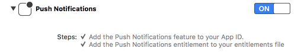
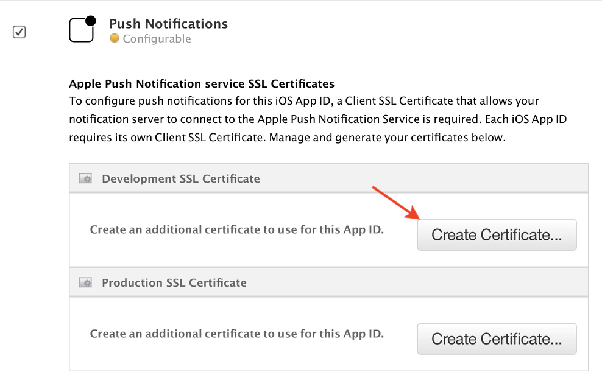
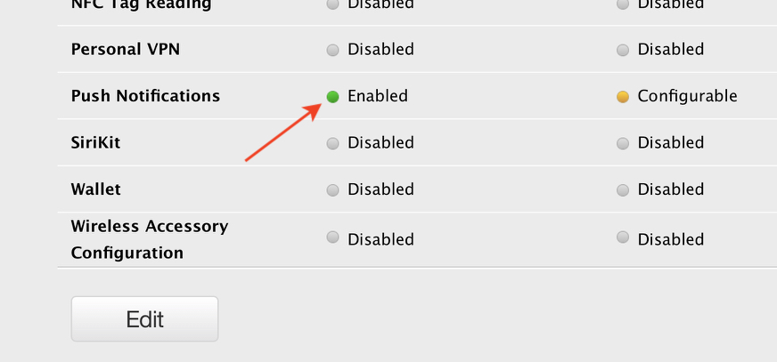

# W7D1 Lighthouse Lecture

##  User/Push Notification

* So we've heard about `NSNotificationCenter`. It uses the `Observer Design Pattern` to broadcast data from the system (or your own code) to your code in a completely decoupled way. The class used for this is called `NSNotificationCenter`. 

* There is also a mechanism on iOS of user notifications.  Don't confuse the 2.

* User notifications enable an app that is no longer running to alert the user about some event. 

* Eg. Let's say the user setup a calendar event inside your app. User notifications can alert the user of this event even if your app is not running.

* User notifications can be used to pass the user a message. For instance, an impending calendar event, timer event, location geofencing event, or some important data change on a remote server.

* There are 2 types of user notifications on iOS: `local` and `remote`.

* User Notifications can display alerts, and play default or custom sounds to the user, as well as badge the app icon with a number. 

* When the app is in the *foreground* alerts/sounds/badging is off by default, but it is easy to override this behaviour.

* Local and remote notifications look and sound the same from the user's point of view.

* User's can tap to launch the app from the notification or ignore them.

* Local notifications are scheduled and sent by the app itself (no internet needed).

* Remote notifications (aka `Push Notifications`) originate on a remote server (an app may call this server with the payload) that sends a payload to `Apple's Push Notification Service` (APNS).

* APNS in turn calls the device(s) and sends the payload securely.

* For remote notifications, your server environment should be capable of receiving data from user devices and sending notification-related data to APNS.

* Most BAAS systems also include push notification support.


* Note there are 2 Notification API's. `UILocalNotifictions`, and the new system called `UNUserNotifications`. 

* `UNUserNotifications` was introduced in iOS 10. So, you might need to use both API's in an app that is backward compatible. :(

* `UNUserNotification`s is way more powerful. (It goes without saying, prefer current API's over legacy ones).

* `UNUserNotification`s supports media attachments with the `UNNotificationAttachment` object. This allows attaching audio, video and images to your notifications. 

These attachments can't be sent remotely. Instead you will use a notification service extension to modify your remote notification before it is delivered which allows you to pull in resources locally or remotely. (see [UNNotificationServiceExtension](https://developer.apple.com/documentation/usernotifications/unnotificationserviceextension) for more details.) 

# ✅ Demo Local Notification

#### The steps for configuring a local notification are as follows:

1. Request authorization using `requestAuthorization(options:completionHandler:)` (same for both local and remote notifications)
1. Create and configure a `UNMutableNotificationContent` object with the notification details.
1. Create a `UNCalendarNotificationTrigger`, `UNTimeIntervalNotificationTrigger`, or `UNLocationNotificationTrigger` object to describe the conditions under which the notification is delivered.
1. Create a `UNNotificationRequest` object with the content and trigger information.
1. Call the `addNotificationRequest:withCompletionHandler:` method to schedule the notification.

# ✅ Remote Notification Demo

1. RN require a device, and an Apple Developer Membership.
1. We will fake out the server using an app called [Pusher](https://github.com/noodlewerk/NWPusher).
1. Simple install: `brew cask install pusher` 

## Setup Push Service

1. Make sure you App's `Bundle Identifier` is unique.
1. Enable Push Service in the `Capabilities Tab` of your Xcode project.

1. Log in to [https://developer.apple.com/](https://developer.apple.com/) and verify that your app has push notifications enabled (it will be amber).
1. Edit the permissions and click the *Create Certificate...* button for the *Development* type. Follow the instructions. <br><br>

1. After you upload the certification the amber light should turn to green.




```swift
import UIKit
import UserNotifications

@UIApplicationMain
class AppDelegate: UIResponder, UIApplicationDelegate {
  
  var window: UIWindow?
  func application(_ application: UIApplication, didFinishLaunchingWithOptions launchOptions: [UIApplicationLaunchOptionsKey: Any]?) -> Bool {
    registerForNotifications(remote: true)
    return true
  }
}


extension AppDelegate {
  // Register to receive notifications
  
  private func registerForNotifications(remote: Bool = false) {
    UNUserNotificationCenter.current().requestAuthorization(options: [.alert, .sound, .badge]) {
      (granted, error) in
      print(#line, "Permission granted: \(granted)")
      guard granted else { return }
      self.checkNotificationSettings(remote: remote)
    }
  }
  
  private func checkNotificationSettings(remote: Bool) {
    UNUserNotificationCenter.current().getNotificationSettings { (settings) in
      print(#line, "Settings: \(settings)")
      guard settings.authorizationStatus == .authorized else {
        // Good place to notify the user how not having notifications might affect their experience
        return
      }
      // Register for Remove Notifications
      if remote {
        DispatchQueue.main.async {
          UIApplication.shared.registerForRemoteNotifications()
        }
      }
    }
  }
  
  // Remove notification Callbacks
  
  func application(_ application: UIApplication,
                   didRegisterForRemoteNotificationsWithDeviceToken deviceToken: Data) {
    let tokenParts = deviceToken.map { data -> String in
      return String(format: "%02.2hhx", data)
    }
    let token = tokenParts.joined()
    print("Device Token: \(token)")
    print(#line, token)
    // you could send this token to a server, but don't rely on it because it will change if the user deletes the app for example
  }
  
  func application(_ application: UIApplication,
                   didFailToRegisterForRemoteNotificationsWithError error: Error) {
    print("Failed with error: \(error)")
  }
}

```


# References

* [Local and Remote Notification Programming Guide](https://developer.apple.com/library/content/documentation/NetworkingInternet/Conceptual/RemoteNotificationsPG/)
* Simple PHP Script for testing notifications
* For Background Notifications [See](https://www.google.ca/url?sa=t&rct=j&q=&esrc=s&source=web&cd=1&cad=rja&uact=8&ved=0ahUKEwj8-JrtisLZAhVHdt8KHUIqB5wQygQIMDAA&url=https%3A%2F%2Fdeveloper.apple.com%2Flibrary%2Fcontent%2Fdocumentation%2FNetworkingInternet%2FConceptual%2FRemoteNotificationsPG%2FCreatingtheNotificationPayload.html%23%2F%2Fapple_ref%2Fdoc%2Fuid%2FTP40008194-CH10-SW8&usg=AOvVaw3A58cCkTEEdVeYOPcvIiW3).

---

# CloudTracker REST Requests
